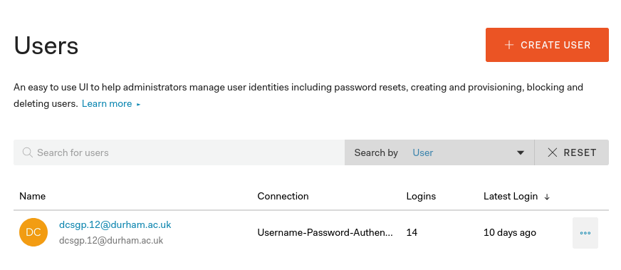

=========================================================
Authentication Expansion
=========================================================

Before expanding the authentication, it should first be installed, this
can be done by following the guide in the installation section of this
user manual.

Adding and removing users
-------------------------

One of the most common functions when expanding will be to add and
remove users. This can be done from the Auth0 dashboard.

On the sidebar, click on the **Users & Roles** tab, this will take you
to the following screen

Adding a user can be done by clicking the ``CREATE USER`` button, and
removing a user can be done by clicking the three dots next to a given
user.

Allowing social integration
---------------------------

Social integration is a very popular choice, such as signin with Google
as it means you don’t have to remember passwords.

This can easily be done in Auth0 by clicking on the **Connections** tab
followed by the **Social** tab, then enable the switch of the social
providers you want.

Customising the login page
--------------------------

This is something that would most likely be done when the company logo
is updated to ensure brand consistency.

From the dashboard, click on the **Universal Login** tab, and this will
allow you to specify a company logo and colours.
