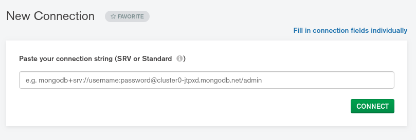
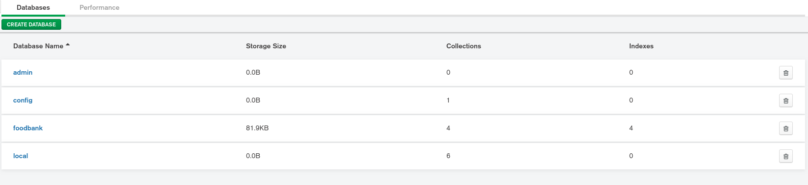

=========================================================
Database Expansion
=========================================================
The database we have chosen is `MongoDB <https://www.mongodb.com/>`__
some details on the basic setup of this are included in the database
installation section.

The easiest way to expand the database is using `MongoDB
Compass <https://www.mongodb.com/products/compass>`__ which is available
for all operating systems. The full documentation for this software is
available `here <https://docs.mongodb.com/compass/master/>`__.

When you open the program you will be greeted with this input:

We will include this URL in the handover package, it can also be found
in the ``routes/stocktake.js`` file of the backend assigned as ``URL``.

Once you have connected, you will see a screen showing the databases,
below is a screenshot of what this looks like for the default setup.

  
If you want to add more features to the database you can use
``CREATE DATABASE`` to add a new database for storing more information.

In each database there are collections, which store your data, you can
access the collections in a database by clicking on the name of the
database. If you want to add more collections, this can be done here in
the same way as adding a database.

By clicking on a collection, you can see the stored data, this is useful
for testing purposes as it allows you to immediately see the changes
made to the data.
