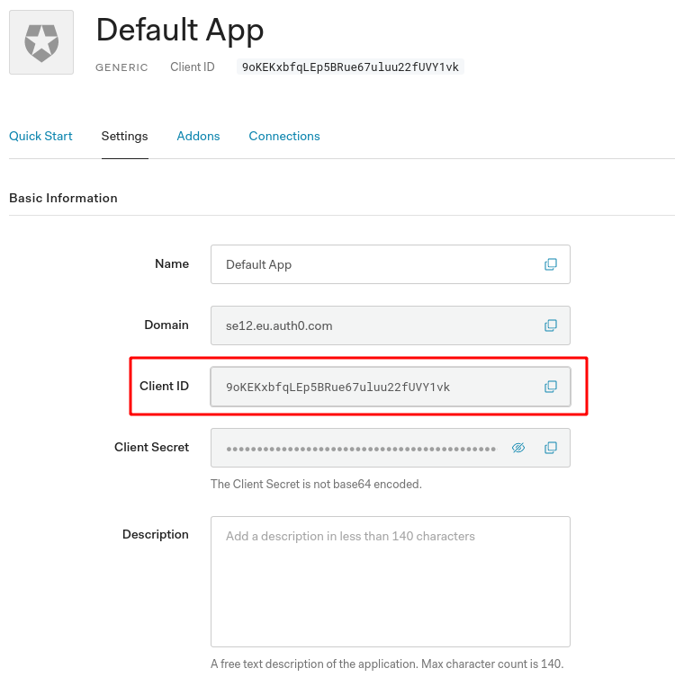

=========================================================
Authentication
=========================================================

Authentication for the website is handled through
`Auth0 <https://auth0.com/>`__ the free tier allows for up to 7000
users, which should be more than ample.

The process of transferring the account to one that you own is very
simple:

1. Sign up for Auth0 `here <https://auth0.com/signup>`__
2. Under the applications tab on the dashboard create a new Generic
   application
3. Copy the client ID from the application, as pictured below

4. Paste this value under ``clientID`` in ``auth_config.json``, which is
   located in the ``src`` folder of the ``frontend`` server
5. Also change the domain in the ``auth_config.json`` file, this domain
   can also be found in the application, as shown below

6. Disable signups by going to the connections tab of the dashboard,
   clicking on ``Username-Password-Authentication``, then turning on the
   disable signups option as shown below

This is done as otherwise any user could come and sign up for the system
without permission
