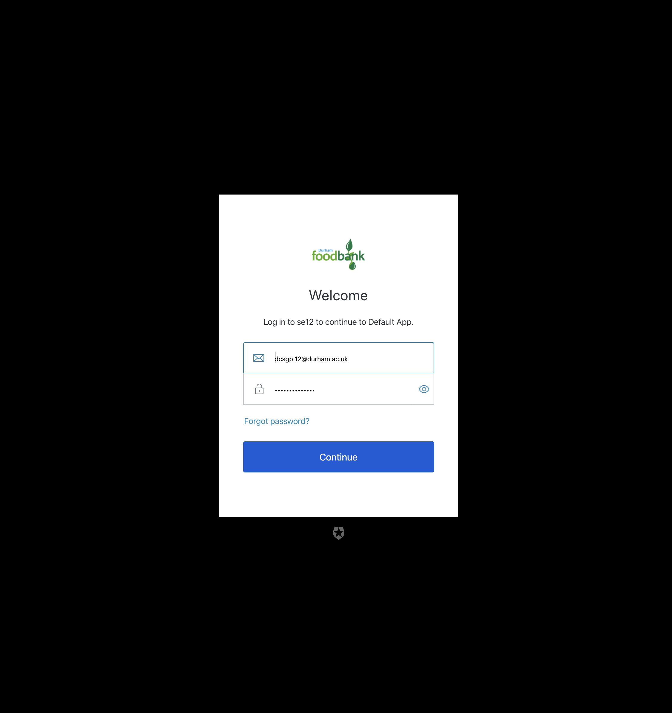

=========================================================
Overview
=========================================================

Login
-----

To sign in, Click on the hamburger menu button in the top left hand
corner and click login.

Sign in page
------------

Once you’ve clicked login, you will be redirected to Auth0’s signin
page, you are prompted to enter the credentials either you created, or
the development credentials provided.

Side Bar
--------

You can click any icon or text to navigate to the respective target. To
view the full menu you can click the hamburger menu in the top left hand
corner to expand the side bar.

* By default the Documentation tab is always accessible with or without logging in. 
* Once signed in, all warehouse features are accessible.

Signing Out
-----------

To Sign out, click on the circular user icon image in the sidebar, and
then click log out.
