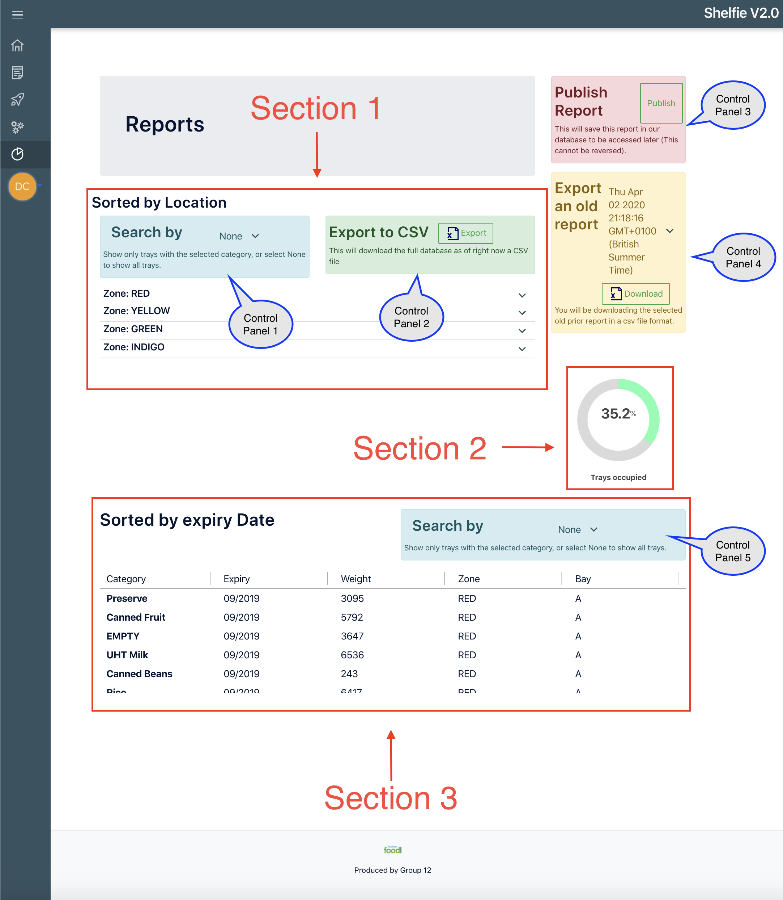
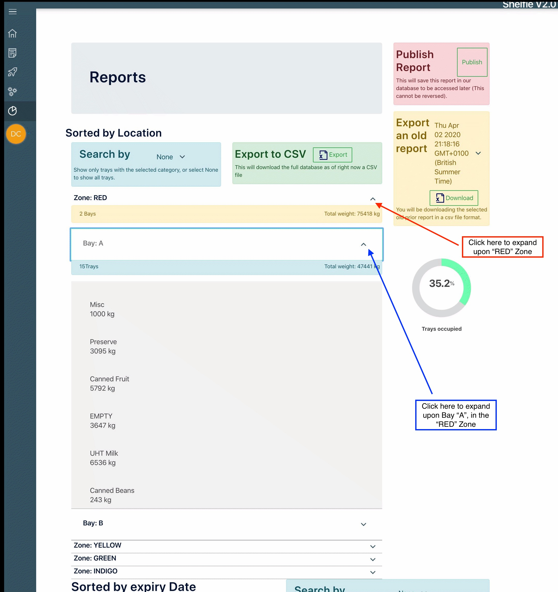
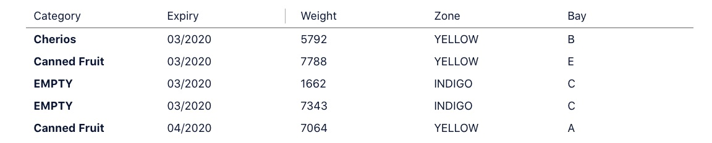

=========================================================
Reports
=========================================================
Access by clicking reports in the side bar.

What you can do
---------------

-  .. rubric:: Search for all items that match a certain category, and
      where to find them.
      :name: search-for-all-items-that-match-a-certain-category-and-where-to-find-them.

-  .. rubric:: View a snapshot of the warehouse categorised by location.
      :name: view-a-snapshot-of-the-warehouse-categorised-by-location.

-  .. rubric:: View a list of all trays ordered by their expiry date.
      :name: view-a-list-of-all-trays-ordered-by-their-expiry-date.

-  .. rubric:: export a csv file containing all the trays in the
      warehouse.
      :name: export-a-csv-file-containing-all-the-trays-in-the-warehouse.

-  .. rubric:: Publish a report as a csv file, and keep it stored for
      future trend reporting.
      :name: publish-a-report-as-a-csv-file-and-keep-it-stored-for-future-trend-reporting.

-  .. rubric:: See a percentage of all free trays in the warehouse to
      get an accurate representation of how full the warehouse is.
      :name: see-a-percentage-of-all-free-trays-in-the-warehouse-to-get-an-accurate-representation-of-how-full-the-warehouse-is.

      
Overview
~~~~~~~~

1. ``Section 1`` on the diagram shows you the snapshot of the warehouse.

   -  you can filter this snapshot to only show trays that contain a
      desired category by choosing it from the drop down menu in
      ``Control Panel 1``

2. You can export the full database of trays at this point in time into
   a CSV file and download it.

   -  You can do this by clicking ``Export`` in ``Control Panel 2``.

3. You can save the snapshot of the warehouse on the server for
   guaranteed future access, by clicking ``Publish`` in
   ``Control Panel 3``.

   -  This cannot by reversed, so only publish if and when it is
      absolutely necessary to do so, e.g. on a weekly basis after stock
      is taken.

4. You can download published reports in a csv format by selecting the
   report that was published from the dropdown list in
   ``Control panel 4`` and clicking the ``Download`` button in
   ``Control Panel 4``.

Navigating the warehouse
~~~~~~~~~~~~~~~~~~~~~~~~

-  Clicking on the target zone to expand.

   -  You will see the total weight of all products in the zone
   .. image:: images/reports/weights.png
     :width: 500
     :align: center
   -  Followed by a list of bays that the zone contains, or the bays
      that contain a category to be searched for.

      -  Expanding on a bay will show you the full weight of trays in
         that bay, this can be useful to see if a bay is too heavily
         laden.
      -  Beneath is a list of all the trays that match the search
         criteria, (their weight, category and expiry).

* Note: you will have to expand on each acordion manually to see the
  contents. This is meant to create a clean environment to view the
  data, if this is not suitable you can:
  
  1. export to CSV,
  2. Open the file in Microsoft Excel, and apply filters to each column and perform
  a search based on any criteria, sort by any field. A full feature list
  can be found here: `Help with Microsoft Excel
  Filters <https://support.office.com/en-gb/article/filter-data-in-a-range-or-table-01832226-31b5-4568-8806-38c37dcc180e>`__

Determine how full the warehouse is
~~~~~~~~~~~~~~~~~~~~~~~~~~~~~~~~~~~

-  The progress wheel in ``Section 2`` shows the percentage of the tray
   spaces in the warehouse that have been declared as empty on the most
   recent stock take.

View an ordered list of the next Expiring trays
~~~~~~~~~~~~~~~~~~~~~~~~~~~~~~~~~~~~~~~~~~~~~~~

In ``Section 3`` of figure 1, you can see an ordered list of all the
trays in the warehouse.

-  You can filter the list by a chosen category in drop down menu within
   ``Control Panel 5``.

