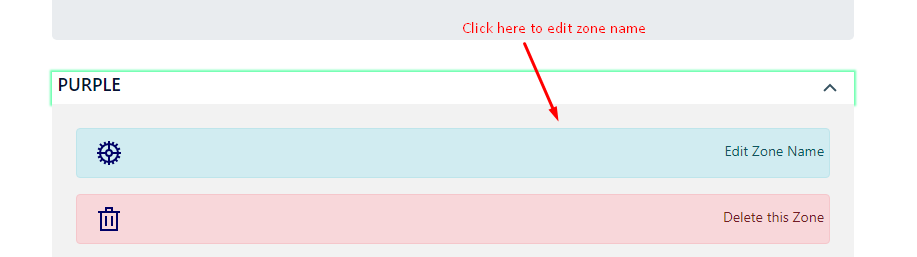
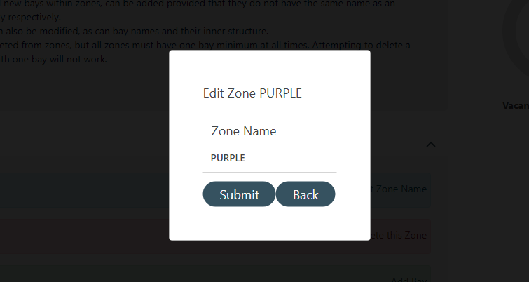
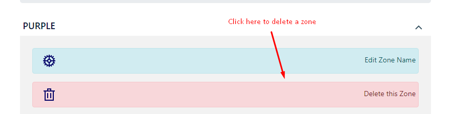
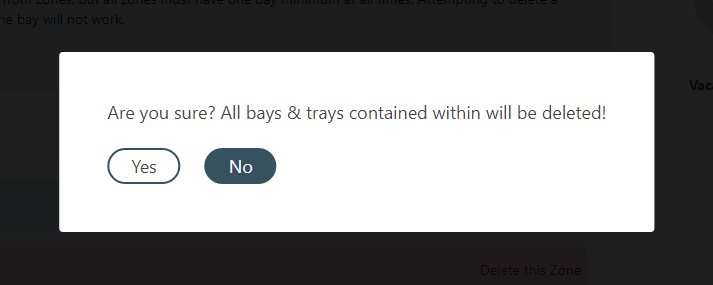
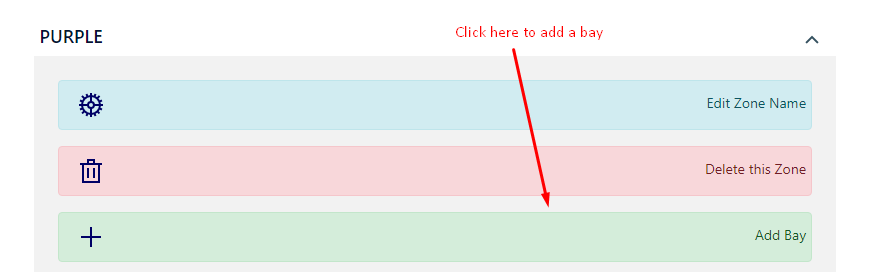
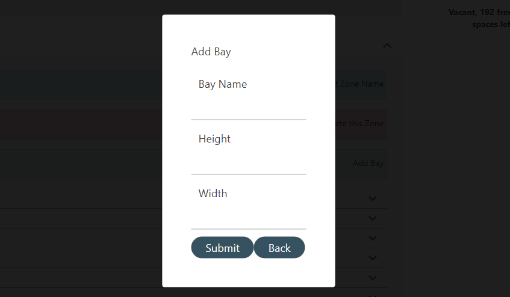
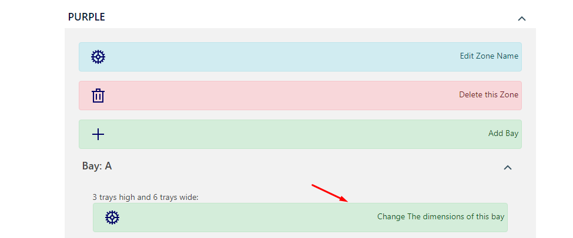
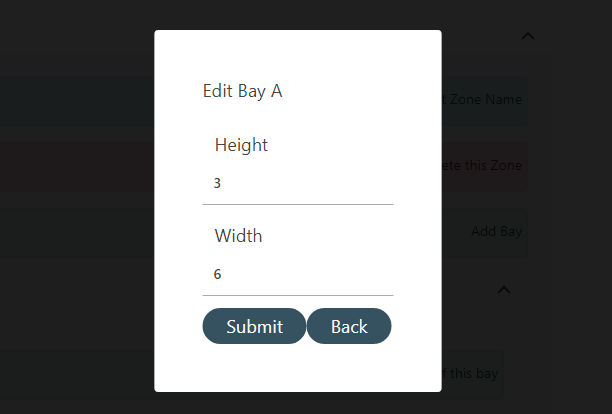
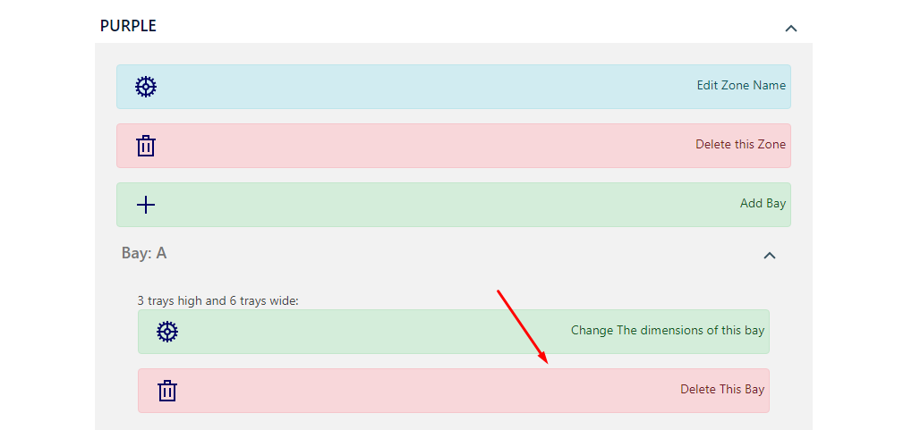
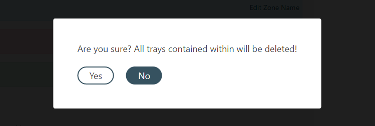

=========================================================
Warehouse Manager
=========================================================
Access by clicking Warehouse Manager in the side bar.

Overview
--------

When loaded, this page collects all of the zones in the database, as
well as the bays contained within them, and displays them to the user in
an accordion style menu.

On the left is a wheel that displays the percentage of trays filled out
of the total potential number of trays in the warehouse, and also lists
the exact number of trays that are empty.

Whenever a (valid) change is made to any of these zones and bays, the
page will be refreshed accordingly to display the changes.

There are various types of changes and actions that you can perform to
the zones and bays, as follows.

Actions to Perform
------------------

1. A zone can be added by selecting the button on the far right and
   entering valid data into the dropdowns. Zone names must be unique.

  

2. Zone names can be changed by selecting a zone in the dropdown, then
   clicking the edit zone name. Enter a zone name that is currently not
   in use.

 

3. Zones can be deleted by clicking the delete zone button in its
   dropdown and then confirming.

   -  NOTE: All bays and trays contained inside the zone will also be
      deleted.

  

4. Bays can be added to any zone by clicking on the zone you wish to add
   the bay to and entering valid data. Bay names must be unique within
   zones.

  

5. Bay dimensions can be altered by selecting a bay inside a zone then
   entering new values.

  

6. Bays can also be deleted - provided that it is not the final bay in a
   zone.

   -  NOTE: All trays contained inside the bay will also be deleted.

  

